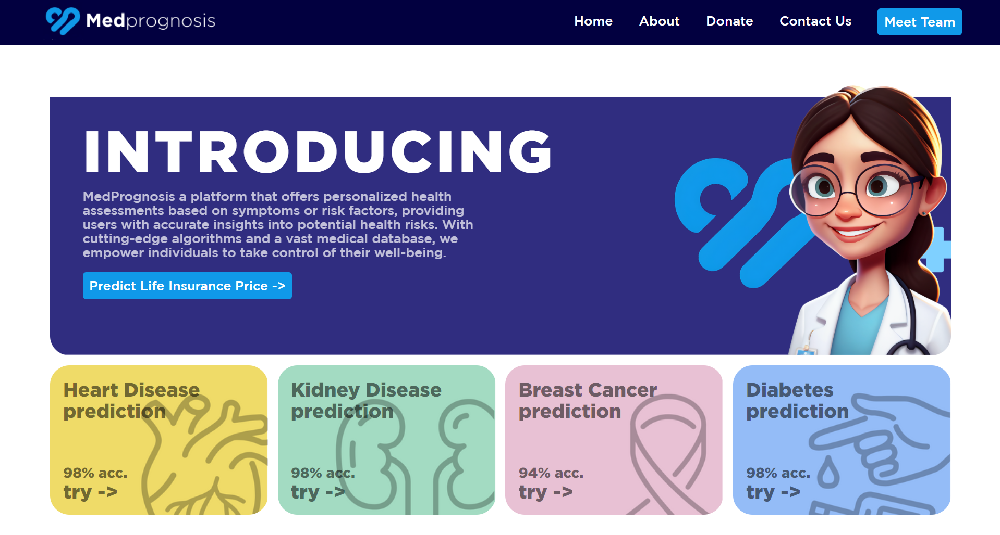
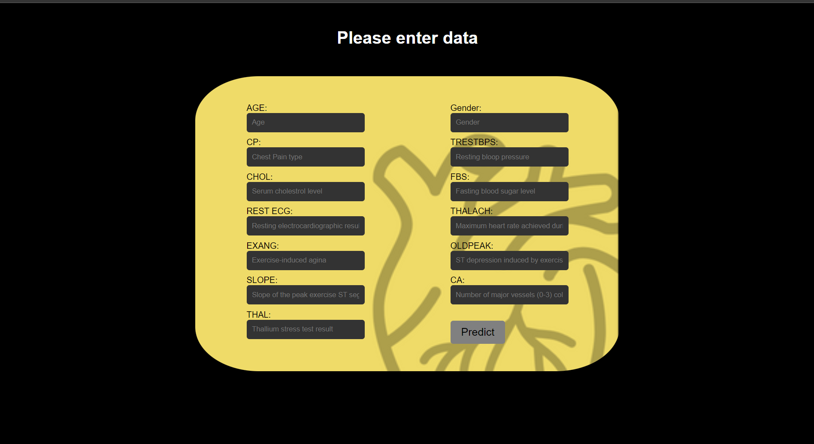
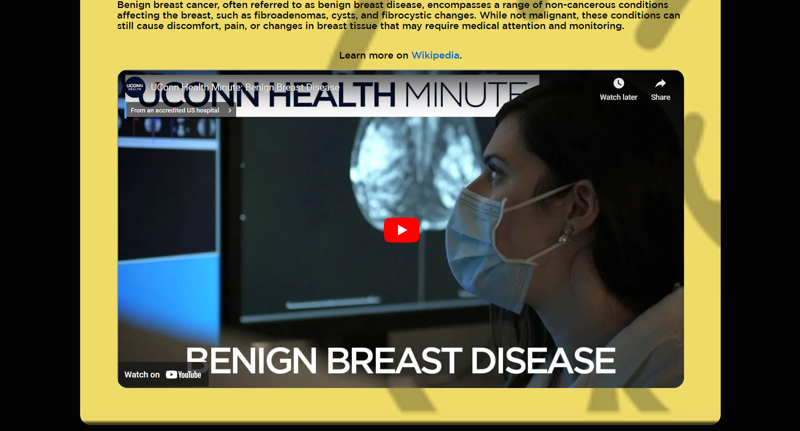
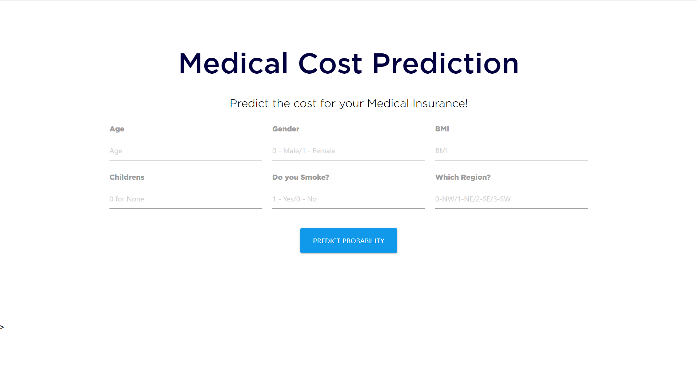

# 🏥 MedPrognosis 🏥 </h1>

 
Foresight for medical decisions and Insurance Prediction.

## 🌐 Introduction
- [What is MedPrognosis?](#%F0%9F%A4%96-what-is-medprognosis%3F)
- [How Medprognosis Works?](#%F0%9F%9A%80-how-medprognosis-works)
- [Join the Movement: Contribute!](#%F0%9F%92%A1-how-to-contribute)
- [Our Amazing Team](#%F0%9F%99%8C-our-amazing-team-%F0%9F%99%8C)

## 🤖 What is Medprognosis?

## 🤖 What is Medprognosis?

MedPrognosis is a machine learning-based system that aims to detect heart disease, kidney disease, breast cancer and diabetes using patient data. This system also says the estimated insurance costs associate with each condition. This project uses various python libraries such as Numpy for performing numerical operations, Pandas for manipulating data, Scikit-learn for algorithm of machine learning and Matplotlib for visualizing data. A dataset that has recorded patient’s information along with their respective insurance coverage was collected and preprocessed using these libraries.

Future work includes expanding the system to detect additional diseases and integrating a feature to recommend nearby hospitals based on the patient's diagnosed condition.

## 🚀 How Medprognosis Works

Several Machine learning models like logistic regression, linear regression, SVM and KNN were trained on this preprocessed dataset. Heart disease and Breast cancer is done by using logistic regression model, SVM model is used in kidney disease prediction and KNN model is used in the prediction of diabetes.  The insurance cost prediction is done by utilizing linear regression models. The findings of this project may have a significant influence on early detection of diseases as well as management of healthcare costs. By offering accurate timely forecasts, MedPrognosis can help health care practitioners make rational choices leading to better outcomes for patients while decreasing financial burden.

## 💡 How to Contribute

  ### 1️⃣ Getting Started

  - **Fork**: Grab your personal copy by forking the repository.
  - **Clone**: Bring it on your local machine with git clone YOUR-REPO-LINK.
  - **Setup**: Install necessary tools. Just run command.

  ### 2️⃣ Making Meaningful Changes

  - **Understand**: Dive deep and understand the project structure.
  - **Code**: Always follow our coding standards. We believe in clean and readable code!

  ### 3️⃣ Share Your Brilliance: Create a Pull Request

  - **Test**: Before anything, make sure everything works as expected.
  - **Branch**: Keep it clean. Create a new one with `git checkout -b feature/your-feature-name`.
  - **Commit**: Make it meaningful! Use `git commit -m 'Add some feature'`.
  - **Push**: Send your changes with `git push origin feature/your-feature-name`.
  - **PR**: Last but not least, open a pull request. We promise to review it as soon as possible!

# Contributor Covenant Code of Conduct

We as members, contributors, and leaders pledge to make participation in our
community a harassment-free experience for everyone, regardless of age, body
size, visible or invisible disability, ethnicity, sex characteristics, gender
identity and expression, level of experience, education, socio-economic status,
nationality, personal appearance, race, caste, color, religion, or sexual
identity and orientation.

We pledge to act and interact in ways that contribute to an open, welcoming,
diverse, inclusive, and healthy community.

## Our Standards

Examples of behavior that contributes to a positive environment for our
community include:

- Demonstrating empathy and kindness toward other people
- Being respectful of differing opinions, viewpoints, and experiences
- Giving and gracefully accepting constructive feedback
- Accepting responsibility and apologizing to those affected by our mistakes,
  and learning from the experience
- Focusing on what is best not just for us as individuals, but for the overall
  community

Examples of unacceptable behavior include:

- The use of sexualized language or imagery, and sexual attention or advances of
  any kind
- Trolling, insulting or derogatory comments, and personal or political attacks
- Public or private harassment
- Publishing others' private information, such as a physical or email address,
  without their explicit permission
- Other conduct which could reasonably be considered inappropriate in a
  professional setting

  ## Enforcement Responsibilities

Community leaders are responsible for clarifying and enforcing our standards of
acceptable behavior and will take appropriate and fair corrective action in
response to any behavior that they deem inappropriate, threatening, offensive,
or harmful.

Community leaders have the right and responsibility to remove, edit, or reject
comments, commits, code, wiki edits, issues, and other contributions that are
not aligned to this Code of Conduct, and will communicate reasons for moderation
decisions when appropriate.

## Scope

This Code of Conduct applies within all community spaces, and also applies when
an individual is officially representing the community in public spaces.
Examples of representing our community include using an official e-mail address,
posting via an official social media account, or acting as an appointed
representative at an online or offline event.

## Attribution

This Code of Conduct is adapted from the [Contributor Covenant][homepage],
version 2.1, available at
[https://www.contributor-covenant.org/version/2/1/code_of_conduct.html][v2.1].

Community Impact Guidelines were inspired by
[Mozilla's code of conduct enforcement ladder][Mozilla CoC].

For answers to common questions about this code of conduct, see the FAQ at
[https://www.contributor-covenant.org/faq][FAQ]. Translations are available at
[https://www.contributor-covenant.org/translations][translations].

[homepage]: https://www.contributor-covenant.org
[v2.1]: https://www.contributor-covenant.org/version/2/1/code_of_conduct.html
[Mozilla CoC]: https://github.com/mozilla/diversity
[FAQ]: https://www.contributor-covenant.org/faq
[translations]: https://www.contributor-covenant.org/translations

## 🙌 Our Amazing Team 🙌

  
  <h3 align="left">Priyam Aggarwal (https://github.com/priyamaggarwal18)</h3>

  
  <h3 align="left">Rashika Anand (https://github.com/Rashikaanand09)</h3>

Rashikaanand09

  
  <h3 align="left">Maintained By - Priyam Aggarwal, Graphics Head Open Source Chandigarh (https://github.com/priyamaggarwal18)</h3>

